<a name="top"></a>

<div align="center">



<br />

<a href="https://github.com/Hacking-Notes/HR-Smuggler/stargazers"></a>
<a href="https://github.com/Hacking-Notes/HR-Smuggler/network/members"></a>
<a href="https://github.com/Hacking-Notes/HR-Smuggler/commits"></a>
<a href="https://hacking-notes.com"></a>

</div>

<br />

This tool is designed to detect potential HTTP request smuggling vulnerabilities in web applications. It supports both HTTP/1.1 and HTTP/2 request smuggling techniques and provides detailed analysis of the responses.

## Features

- **HTTP/1.1 Request Smuggling (TE.CL and CL.TE)**
- **HTTP/2 Request Smuggling**
- **Random User-Agent selection**
- **Detailed response comparison**
- **Interactive mode for single URL or batch processing from file**


## Installation

```bash
git clone https://github.com/Hacking-Notes/HR-Smuggler.git
```


## Usage

```bash
python HR_Smuggler.py -u <target_url> -b <burp_collaborator_url>
python HR_Smuggler.py -f <file_with_urls> -b <burp_collaborator_url>
```

- **-u, --url**: Single URL to test
- **-f, --file**: File containing multiple URLs to test (one URL per line)
- **-b, --burp**: Burp Collaborator URL (required)


## Example

### Testing a Single URL

```bash
python HR_Smuggler.py -u http://example.com -b http://collaborator.com
```

### Testing Multiple URLs from a File

```bash
python HR_Smuggler.py -f urls.txt -b http://collaborator.com
```


## Detailed Check

The tool compares the responses for potential indicators of request smuggling, including differences in:

- Status codes
- Headers
- Response bodies

If potential request smuggling is detected, further steps are suggested for verification and documentation.


## Next Steps After Detection

1. Check the Burp Collaborator server for unexpected requests.
2. Verify if the Collaborator URL was accessed during the test.
3. Perform additional tests to understand the impact and potential exploitation paths.
4. Document the findings and report the vulnerability if confirmed.


## 🧰 Hacking Notes Ecosystem

<div align="center">

🌐 &nbsp;**[hacking-notes.com](https://hacking-notes.com)** &nbsp;·&nbsp; ✍️ &nbsp;**[blog](https://hacking-notes.medium.com/)** &nbsp;·&nbsp; 💬 &nbsp;**[discord](https://discord.gg/r68ameNHrD)**

</div>

| | Resource | What you get |
| :-: | -------- | ------------ |
| 🗺 | **[Hacker-Roadmap](https://github.com/Hacking-Notes/Hacker-Roadmap)** | Structured paths from beginner to pro — hobbyist, bug bounty, certs & degree. |
| 🔴 | **[RedTeam Notes](https://github.com/Hacking-Notes/RedTeam)** | Offensive security notes: recon, exploitation, Windows & Linux. |
| 🔷 | **[BlueTeam Notes](https://github.com/Hacking-Notes/BlueTeam)** | Defensive security notes: forensics, malware, log & packet analysis. |
| 🧩 | **[Extensions](https://github.com/Hacking-Notes/Extensions)** | Curated Chrome extensions for ethical hacking & recon. |
| 🔖 | **[Bookmarks](https://github.com/Hacking-Notes/Bookmarks)** | Curated hacker bookmark collection, one import away. |


<div align="right"><a href="#top">⬆ back to top</a></div>
